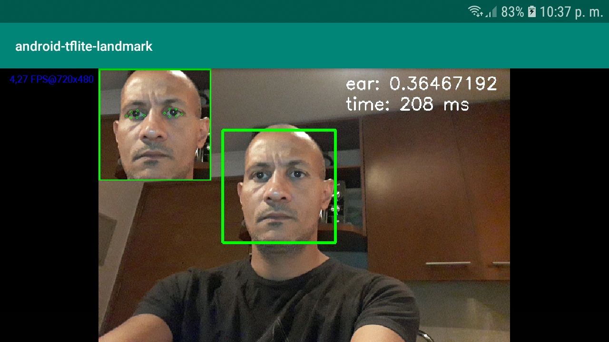

# Drowsiness detection using landamrk face
this repositorie shows a regression for detect landmark face using a Convolution Neural Network. Helen dataset is used for train a CNN. Opencv camera library is used for face detection. Model is deployed in python and Android app.

Step 1: this [notebook](https://github.com/jacr2006/drowsiness-detection/blob/master/Notebooks/data_visualization.ipynb) plots some images and landmark face.

Step 2: this [notebook](https://github.com/jacr2006/drowsiness-detection/blob/master/Notebooks/data_processing.ipynb) scales the images (and landmarks) and converts to gray scale.

Step 3: this [notebook](https://github.com/jacr2006/drowsiness-detection/blob/master/Notebooks/data_training.ipynb) normalizes the images, trains a CNN using Keras, and saves a TensorFlow model.

Step 4: this [notebook](https://github.com/jacr2006/drowsiness-detection/blob/master/Notebooks/data_inference.ipynb) tests regression from an image.

Step 5: this Python [script](https://github.com/jacr2006/drowsiness-detection/blob/master/Test/python_test_tflite_model.py) tests the model on PC.
  

Step 6: this [notebook](https://github.com/jacr2006/drowsiness-detection/blob/master/Notebooks/keras_to_tflite_model.ipynb) transforms H5 TensorFow model to TensorFlow Lite to deploy in Android app.
 

